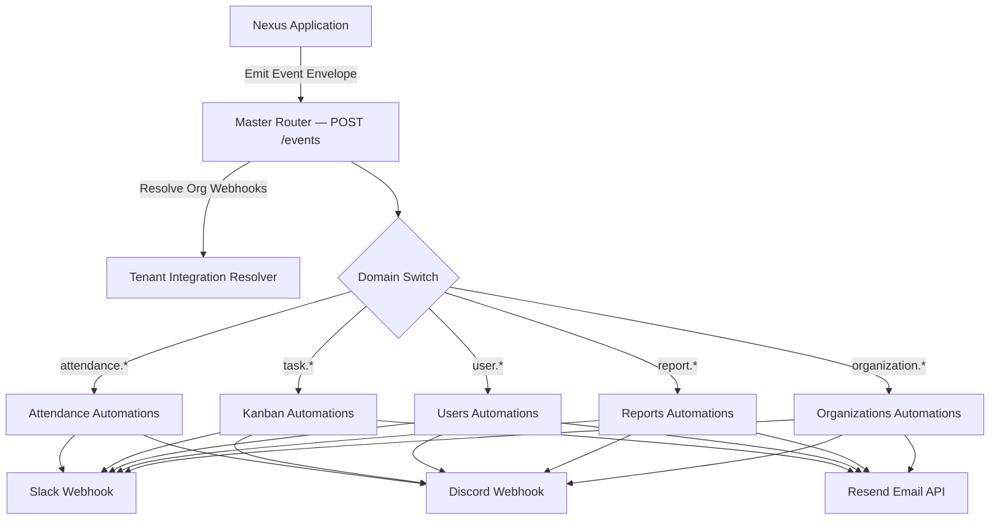

# 🌌 Nexus

> **Connecting Students, Supervisors, and Success.**

Nexus is a modern web-based **On-the-Job Training (OJT) Management System** designed to streamline internship administration through GPS-verified attendance, real-time time tracking, collaborative task management, and role-based dashboards.

Built with a modern full-stack architecture, Nexus centralizes attendance monitoring, internship progress, and project collaboration into a single intuitive platform for students, supervisors, and administrators.

---

## ✨ Overview

Managing OJT programs often involves multiple spreadsheets, paper attendance logs, and disconnected communication channels. Nexus eliminates these inefficiencies by providing a centralized platform where attendance, task management, reporting, and user administration work seamlessly together.

Whether you're a student logging your daily attendance, a supervisor monitoring trainee progress, or an administrator managing the entire internship program, Nexus provides the tools needed to simplify every stage of the OJT experience.

---

# 🚀 Key Features

## ⏱️ Smart Time Tracking

* One-click Clock In / Clock Out
* Automatic computation of rendered hours
* Daily attendance history
* Required OJT hours progress tracking

---

## 📍 GPS-Verified Attendance

Nexus ensures attendance authenticity through configurable location verification.

* GPS-based Clock In / Clock Out
* Configurable workplace coordinates
* Adjustable attendance radius
* Automatic distance validation
* Supervisors and administrators are exempt from GPS restrictions

---

## 📋 Kanban Task Management

A built-in collaborative Kanban board keeps internship tasks organized.

* Drag-and-drop task management
* Custom workflow columns
* Task assignment
* Priority levels
* Due dates
* Rich descriptions
* File attachments
* Image, video, PDF, and document support

---

## 👥 Role-Based Access Control

### 🎓 OJT

* Clock In / Clock Out
* View attendance history
* Track completed hours
* Access assigned Kanban tasks
* Upload task attachments

### 👨‍🏫 Supervisor

* Monitor all assigned OJTs
* Review attendance records
* Manage Kanban tasks
* Export attendance reports

### 👨‍💼 Administrator

* Complete user management
* Configure GPS attendance settings
* Manage departments
* Generate reports
* Manage Kanban workflows
* System-wide administration

---

## 📊 Reporting

Generate attendance reports with a single click.

* CSV Export
* Attendance summaries
* Hour tracking
* Historical attendance records

---

# ⚡ How Nexus Automates your Workflow

Nexus features an event-driven, decoupled automation engine powered by **n8n** and transactional email via **Resend**. When key actions occur in the platform, Nexus emits standardized event envelopes to an intelligent Master Router, which dynamically resolves tenant configurations and dispatches events to specialized domain workflows across **Slack**, **Discord**, and **Email**.



---

### 1. 🔀 Master Router & Architecture
* **Secure Webhook Ingress**: Receives events at `POST /events`, secured with API key validation via `X-Automation-Key`.
* **Dynamic Multi-Tenant Integrations**: Automatically queries the organization's configured Slack and Discord webhook endpoints on the fly (`/api/automation/integrations/resolve`), ensuring alerts reach the right workspace channels without hardcoded endpoints.
* **Domain-Based Dispatching**: Evaluates event prefixes (`attendance.*`, `task.*`, `user.*`, `report.*`, `organization.*`) and executes the corresponding sub-workflow asynchronously.

---

### 2. ⏱️ Attendance Automations
Keeps supervisors and team channels informed of real-time intern activity and attendance compliance:

* **Clock In (`attendance.clocked_in`)**: Sends instant notification alerts to Slack and Discord channels when an intern clocks in.
* **Clock Out (`attendance.clocked_out`)**: Broadcasts real-time clock-out notifications to team channels.
* **Late Arrival Alerts (`attendance.late`)**: Immediately notifies supervisors on Slack and Discord when an intern clocks in past their scheduled start time.
* **Absence Alerts (`attendance.absent`)**: Automatically flags student absences to supervisor Slack and Discord channels for rapid follow-up.

---

### 3. 📋 Kanban & Task Automations
Streamlines collaboration and task turnaround across the internship lifecycle:

* **Task Created (`task.created`)**: Posts an alert to Slack and Discord channels whenever a new task is added to the Kanban workspace.
* **Task Assignment (`task.assigned`)**: Triggers an automated notification email to the assigned intern with task details, priority, and direct board links.
* **Task Ready for Review (`task.completed`)**: Automatically notifies supervisors on Slack and Discord when an intern marks a task ready for review.
* **Task Deleted (`task.deleted`)**: Broadcasts task removal notifications across team chat channels.

---

### 4. 👥 User Management & Onboarding Automations
Ensures a smooth onboarding experience from the moment a user joins:

* **User Created (`user.created`)**: Automatically delivers a personalized onboarding welcome email to the newly registered student or supervisor.
* **User Invited (`user.invited`)**: Dispatches an official invitation email containing a secure token link and workspace joining instructions.
* **Account Deleted (`user.deleted`)**: Sends security and administrative alerts to Slack and Discord when an account is decommissioned.

---

### 5. 📊 Report Submission & Review Automations
Automates the feedback loop between students and supervising faculty:

* **Report Generated (`report.generated`)**: Immediately alerts supervisors on Slack and Discord when a new OJT progress report is submitted for review.
* **Report Approved (`report.approved`)**: Sends an official confirmation email to the student informing them that their report has been reviewed and approved.
* **Report Rejected / Revision Needed (`report.rejected`)**: Delivers an email to the student with supervisor feedback and revision instructions.

---

### 6. 🏢 Organization & Workspace Automations
Maintains tenant workspace communication and member lifecycle:

* **Organization Created (`organization.created`)**: Dispatches alerts to designated admin Slack and Discord channels upon new organization registration.
* **Member Added (`organization.member_added`)**: Sends an onboarding welcome email to newly added organization members.
* **Member Removed (`organization.member_removed`)**: Sends formal offboarding and access notice emails upon member removal.

---

# 🛡 Security

Nexus leverages Supabase Authentication and Row-Level Security (RLS) to ensure secure access across all user roles.

Security features include:

* Authentication
* Role-based authorization
* Protected API routes
* GPS attendance validation
* Secure file storage
* Soft-delete user management

---

# 🛠 Technology Stack

| Category            | Technology       |
| ------------------- | ---------------- |
| Frontend            | Next.js 16       |
| Language            | TypeScript       |
| Backend             | Supabase         |
| Database            | PostgreSQL       |
| Authentication      | Supabase Auth    |
| Storage             | Supabase Storage |
| Workflow Automation | n8n              |
| Transactional Email | Resend           |
| UI Framework        | Material UI v7   |
| Styling             | Tailwind CSS v4  |
| Drag & Drop         | @dnd-kit         |

---

# 📱 Core Modules

* Dashboard
* Attendance Management
* GPS Verification
* Hours Progress Tracking
* Kanban Workspace
* User Management
* Reports & Analytics
* Site Settings

---

# 📂 Project Structure

```text
src/
├── app/
│   ├── dashboard/
│   │   ├── admin/
│   │   ├── supervisor/
│   │   ├── ojt/
│   │   ├── attendance/
│   │   ├── kanban/
│   │   └── reports/
│   ├── api/
│   └── login/
│
├── components/
│   ├── attendance/
│   ├── kanban/
│   └── shared/
│
├── lib/
│   ├── context/
│   ├── hooks/
│   ├── supabase/
│   └── utils/
│
├── types/
└── proxy.ts
```

---

# 🎯 Design Principles

Nexus was built around four core principles:

* **Simplicity** — Clean, intuitive interfaces that minimize learning time.
* **Accountability** — GPS verification and automatic attendance tracking improve reliability.
* **Collaboration** — Integrated Kanban boards encourage organized teamwork.
* **Scalability** — Modern architecture built for future expansion and institutional deployment.

---

# 🌌 Why Nexus?

The name **Nexus** represents a central point of connection—bringing together students, supervisors, administrators, attendance tracking, task management, and reporting into one unified ecosystem.

Instead of juggling multiple tools, Nexus serves as the single hub where internship management happens efficiently, transparently, and securely.