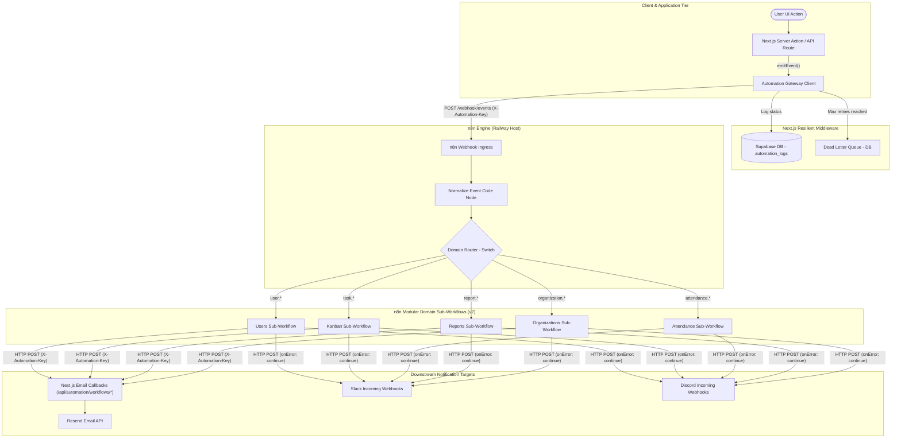

# Nexus Automation System — Production Implementation Guide (v2 Architecture)

This document serves as the single source of truth for the Nexus Automation System architecture. It details the v2 event-driven automation engine, deployment pipeline, domain sub-workflows, event envelope contracts, and notification delivery mechanisms across **Resend Email**, **Slack**, and **Discord**.

---

## 1. System Overview

The Nexus Automation System uses an **event-driven, decoupled architecture**. Rather than hardcoding third-party integrations (like Slack, Discord, or transactional email SDKs) directly into Next.js business handlers, the application acts as a clean domain event emitter. It broadcasts standardized event envelopes to a centralized automation engine (n8n on Railway), which orchestrates routing, notification rendering, and external webhooks.

### Component Responsibilities

* **Next.js Application**: Executes core domain mutations (user onboarding, Kanban task updates, attendance clock-in, report reviews, organization management). Emits fire-and-forget domain events via `emitEvent()`.
* **Automation Gateway Client**: Resilient middleware in `src/lib/automation/client.ts`. Envelopes payloads in standard JSON schemas, manages retries with exponential backoff, and writes failure logs/DLQ records to Supabase.
* **n8n Master Router (v2)**: Listens at `POST /webhook/events`, unwraps payload envelopes in the Normalize Event node, and prefix-routes events (`user.*`, `task.*`, `attendance.*`, `report.*`, `organization.*`) to dedicated child sub-workflows.
* **n8n Domain Sub-Workflows (v2)**: Five modular sub-workflows (`Users`, `Kanban`, `Attendance`, `Reports`, `Organizations`) executing specific action logic, chat webhooks (Slack/Discord), and Next.js backend email callbacks.
* **Supabase PostgreSQL**: Stores primary business entities and houses `automation_logs` and `automation_dead_letters` tables for administrative audit trails and DLQ replay.
* **Resend API**: Transactional email service, invoked via Next.js `/api/automation/workflows/*` callback endpoints using verified API key header authentication (`X-Automation-Key`).

---

## 2. System Architecture (v2 Topology)



---

## 3. Event Envelope Specification & Catalog

Every domain event transmitted to n8n is wrapped in a standard `AutomationEvent<T>` JSON envelope:

```typescript
interface AutomationEvent<T = Record<string, unknown>> {
  id: string;              // Unique event ID (e.g. "evt_1721854800000_abc123")
  event: string;           // Registered event name (e.g. "user.invited", "task.assigned")
  actorId: string;         // User ID performing the action
  organizationId?: string; // Tenant Organization ID (if applicable)
  payload: T;              // Event payload data dictionary
  timestamp: string;       // ISO-8601 string timestamp
}
```

### Complete Registered Event Catalog

| Event Name | Domain Category | Payload Highlights | Primary Action / Target |
|---|---|---|---|
| `user.created` | Users | `email`, `name`, `role` | Triggers Welcome Email via Resend |
| `user.invited` | Users | `email`, `orgName`, `inviteUrl` | Triggers Organization Invitation Email |
| `user.deleted` | Users | `email`, `userId` | Dispatches Slack & Discord account deletion alerts |
| `task.created` | Kanban | `taskId`, `title`, `priority` | Dispatches Slack & Discord new task alerts |
| `task.assigned` | Kanban | `taskId`, `title`, `assigneeId` | Triggers Task Assignment Email to intern |
| `task.completed` | Kanban | `taskId`, `title`, `completedBy` | Dispatches Slack & Discord review alerts |
| `task.deleted` | Kanban | `taskId`, `title`, `assigneeId` | Triggers Task Removal Notice Email |
| `attendance.checked_in` | Attendance | `userId`, `timestamp`, `lat`, `lng` | Timesheet logging |
| `attendance.checked_out` | Attendance | `userId`, `timestamp` | Shift hour summary calculation |
| `attendance.late` | Attendance | `studentName`, `checkInTime` | Dispatches Slack & Discord late arrival alerts |
| `attendance.absent` | Attendance | `studentName`, `date` | Dispatches Slack & Discord absence alerts |
| `report.submitted` | Reports | `reportId`, `title`, `authorName` | Dispatches Slack & Discord report review alerts |
| `report.approved` | Reports | `reportId`, `title`, `internEmail` | Triggers Report Approved Email to intern |
| `report.rejected` | Reports | `reportId`, `title`, `feedback` | Triggers Report Revision Request Email |
| `organization.created` | Organizations | `orgId`, `name`, `ownerEmail` | Dispatches Slack & Discord new org alerts |
| `organization.member_added` | Organizations | `orgId`, `memberEmail`, `role` | Triggers Member Welcome Email |
| `organization.member_removed` | Organizations | `orgId`, `memberEmail` | Triggers Member Offboarding Notice Email |
| `organization.updated` | Organizations | `orgId`, `name` | Organization audit logging |

---

## 4. n8n Master Router & Sub-Workflow Engine (v2)

### Structure & File Inventory (`workflows/v2/`)

All v2 n8n workflow definitions are stored in [`workflows/v2/`](file:///d:/repos/ojt-tracker/workflows/v2/):

```
workflows/v2/
├── ARCHITECTURE.md                      # Canonical architectural source of truth
├── nexus-master-router-v2.json          # Master Router definition (with child ID placeholders)
├── nexus-sub-attendance.json            # Attendance domain automations
├── nexus-sub-kanban.json                # Kanban domain automations
├── nexus-sub-organizations.json         # Organizations domain automations
├── nexus-sub-reports.json               # Reports domain automations
└── nexus-sub-users.json                 # Users domain automations
```

### Ingress Normalization & Routing Logic

1. **Webhook Ingress**: Receives POST request at `/webhook/events`.
2. **Normalize Event Node**: Unwraps `$json.body` to `$json`. Crucially preserves `actorId` and `organizationId` keys for backend Zod schema validation.
3. **Prefix Switch Node**: Evaluates `$json.event` using string prefix matching (`startsWith`):
   - `user.` $\rightarrow$ Executes `Nexus — Users Automations`
   - `task.` $\rightarrow$ Executes `Nexus — Kanban Automations`
   - `attendance.` $\rightarrow$ Executes `Nexus — Attendance Automations`
   - `report.` $\rightarrow$ Executes `Nexus — Reports Automations`
   - `organization.` $\rightarrow$ Executes `Nexus — Organizations Automations`
4. **Sub-Workflow Switch Node**: Child workflow matches exact event name (`user.created`, `task.assigned`) and routes to appropriate HTTP notification nodes.
5. **200 OK Response**: Master Router responds `{"received": true}` upon completion.

---

## 5. Automated Deployment & Synchronization

Nexus provides an automated CLI script ([`scripts/sync-n8n.mjs`](file:///d:/repos/ojt-tracker/scripts/sync-n8n.mjs)) for deploying, updates, wiring, and activating workflows.

### Sync Pipeline Execution

To sync local v2 JSON definitions to Railway n8n:

```bash
# 1. Test deployment without altering n8n instance
node scripts/sync-n8n.mjs --dry-run

# 2. Execute live sync and activation
node scripts/sync-n8n.mjs
```

### How the Script Works
1. Queries `GET /api/v1/workflows` using `N8N_API_KEY`.
2. Idempotently creates (`POST`) or updates (`PUT`) the 5 sub-workflows (`Users`, `Kanban`, `Attendance`, `Reports`, `Organizations`) and activates them.
3. Replaces `REPLACE_WITH_*_WORKFLOW_ID` placeholders in `nexus-master-router-v2.json` with actual assigned workflow IDs.
4. Deactivates older Master Router instances to prevent webhook path collisions.
5. Uploads and activates the newly wired Master Router workflow.

---

## 6. Notification Delivery Catalog & Message Formats

### Detailed Message & Transport Mapping

| Domain Event | Target Channel | Endpoint / Destination | Message Format / Content |
|---|---|---|---|
| `user.created` | **Email** | `/api/automation/workflows/welcome-email` | Renders `WelcomeEmail` template to `payload.email` |
| `user.invited` | **Email** | `/api/automation/workflows/invitation-email` | Renders `InvitationEmail` with `inviteUrl` and `orgName` |
| `user.deleted` | **Slack** | `$env.SLACK_WEBHOOK_URL` | `"User account deleted: " + payload.email` |
| `user.deleted` | **Discord** | `$env.DISCORD_WEBHOOK_URL` | `"User account deleted: " + payload.email` |
| `task.created` | **Slack** | `$env.SLACK_WEBHOOK_URL` | `"New task created: " + payload.title` |
| `task.created` | **Discord** | `$env.DISCORD_WEBHOOK_URL` | `"New task created: " + payload.title` |
| `task.assigned` | **Email** | `/api/automation/workflows/task-assignment` | Renders Task Assignment notification to intern |
| `task.completed` | **Slack** | `$env.SLACK_WEBHOOK_URL` | `"Task ready for review: " + payload.title` |
| `task.completed` | **Discord** | `$env.DISCORD_WEBHOOK_URL` | `"Task ready for review: " + payload.title` |
| `task.deleted` | **Email** | `/api/automation/workflows/task-removed-email` | Renders Task Removal notice to intern |
| `attendance.late` | **Slack** | `$env.SLACK_WEBHOOK_URL` | `"Late arrival: " + payload.studentName` |
| `attendance.late` | **Discord** | `$env.DISCORD_WEBHOOK_URL` | `"Late arrival: " + payload.studentName` |
| `attendance.absent` | **Slack** | `$env.SLACK_WEBHOOK_URL` | `"Absence flagged: " + payload.studentName` |
| `attendance.absent` | **Discord** | `$env.DISCORD_WEBHOOK_URL` | `"Absence flagged: " + payload.studentName` |
| `report.submitted` | **Slack** | `$env.SLACK_WEBHOOK_URL` | `"Report submitted for review: " + payload.title` |
| `report.submitted` | **Discord** | `$env.DISCORD_WEBHOOK_URL` | `"Report submitted for review: " + payload.title` |
| `report.approved` | **Email** | `/api/automation/workflows/report-approved-email` | Renders `ReportApprovedEmail` template |
| `report.rejected` | **Email** | `/api/automation/workflows/report-rejected-email` | Renders `ReportRejectedEmail` with supervisor notes |
| `organization.created` | **Slack** | `$env.SLACK_WEBHOOK_URL` | `"New organization created: " + payload.name` |
| `organization.created` | **Discord** | `$env.DISCORD_WEBHOOK_URL` | `"New organization created: " + payload.name` |
| `organization.member_added` | **Email** | `/api/automation/workflows/org-member-welcome-email` | Renders `OrgMemberWelcomeEmail` template |
| `organization.member_removed` | **Email** | `/api/automation/workflows/org-member-removed-email` | Renders `OrgMemberRemovedEmail` notice |

---

## 7. How to Trigger & Test Notifications

### 1. Automatic UI Triggers
- **User Invitations**: Send an invitation from `/dashboard/admin/users` $\rightarrow$ Triggers `user.invited` Email.
- **Kanban Task Mutation**: Create a task in Kanban Board $\rightarrow$ Triggers `task.created` Slack/Discord alerts. Assign an intern $\rightarrow$ Triggers `task.assigned` Email. Move task to Done $\rightarrow$ Triggers `task.completed` Slack/Discord review alerts.
- **Clock-In**: Late clock-in on ClockButton $\rightarrow$ Triggers `attendance.late` Slack/Discord alerts.
- **Reports**: Submit report $\rightarrow$ Triggers `report.submitted` Slack/Discord alerts. Approve/Reject report $\rightarrow$ Triggers `report.approved` or `report.rejected` Emails.

### 2. Manual cURL Ingress Testing

To test any workflow directly without using the UI, POST an event envelope to the n8n Master Router ingress:

```bash
# Test Invitation Email Trigger
curl -X POST https://n8n-production-xxxx.up.railway.app/webhook/events \
  -H "Content-Type: application/json" \
  -H "X-Automation-Key: your-n8n-api-key" \
  -d '{
    "id": "evt_test_1001",
    "event": "user.invited",
    "actorId": "usr_admin_123",
    "organizationId": "org_acme_456",
    "payload": {
      "email": "trainee@example.com",
      "orgName": "Acme Corp",
      "inviteUrl": "https://nexxus.lol/invite/token_123"
    },
    "timestamp": "2026-07-24T21:00:00.000Z"
  }'
```

```bash
# Test Slack & Discord Kanban Alert
curl -X POST https://n8n-production-xxxx.up.railway.app/webhook/events \
  -H "Content-Type: application/json" \
  -H "X-Automation-Key: your-n8n-api-key" \
  -d '{
    "id": "evt_test_1002",
    "event": "task.created",
    "actorId": "usr_supervisor_789",
    "organizationId": "org_acme_456",
    "payload": {
      "title": "Setup Multi-Tenant Integrations",
      "description": "Verify Slack and Discord webhooks"
    },
    "timestamp": "2026-07-24T21:00:00.000Z"
  }'
```

---

## 8. Environment Variables Reference

| Variable | Environment | Description | Example |
|---|---|---|---|
| `AUTOMATION_ENABLED` | Next.js | Enables/disables outbound gateway requests | `true` |
| `N8N_URL` / `N8N_HOST` | Both | Base URL of n8n Railway service | `https://n8n.nexxus.lol` |
| `N8N_API_KEY` | Both | Secret passed in `X-Automation-Key` and `X-N8N-API-KEY` | `n8n_sec_xxxxxx` |
| `RESEND_API_KEY` | Next.js | Resend.com API Key for email sending | `re_123456789` |
| `EMAIL_FROM` | Next.js | Verified transactional sender email | `Nexus <onboarding@nexxus.lol>` |
| `NEXUS_APP_URL` | n8n | Base URL of deployed Next.js backend | `https://nexxus.lol` |
| `SLACK_WEBHOOK_URL` | n8n | Default incoming Slack webhook URL | `https://hooks.slack.com/...` |
| `DISCORD_WEBHOOK_URL` | n8n | Default incoming Discord webhook URL | `https://discord.com/api/...` |

---

## 9. Fault Tolerance & Dead Letter Queue (DLQ)

- **Soft Failures (`onError: continueRegularOutput`)**: All Slack and Discord HTTP nodes define `onError: continueRegularOutput`. Chat notification failures (e.g. rate limits or invalid webhook URLs) will not crash sub-workflows or prevent backend email execution.
- **Retry Mechanism**: Next.js Gateway Client performs exponential backoff retries (`maxRetries: 3`) on network timeouts.
- **Dead Letter Queue**: Exhausted retry failures write the event envelope and error details to `automation_dead_letters` table in Supabase. Admins can view and manually replay failed events from `/dashboard/admin/automation`.
